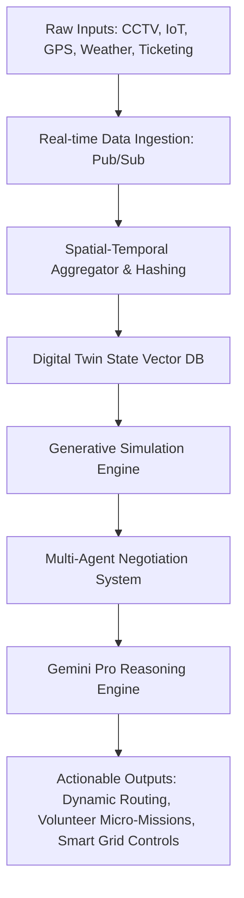
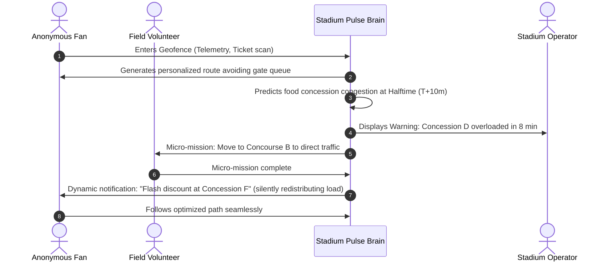
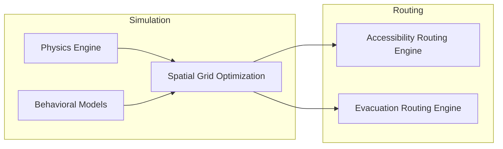

# Stadium Pulse — Systems Architecture Specification
## The Living Digital Twin of Every Fan (FIFA World Cup 2026)

---

## 1. System Overview & Core Paradigms

**Stadium Pulse** represents a shift from reactive event monitoring to proactive, generative, and cognitive stadium management. Instead of simple dashboard displays and retrospective analysis, the stadium functions as a **Living Cognition Engine**. It models every human being, transit vector, energy grid, and retail outlet as an anonymous node inside an active, multi-agent digital twin. 



### 1.1 Core Principles
* **State Space Projection (The Multiverse)**: Every second, the system projects 10 parallel future scenarios ($T+5$, $T+10$, $T+20$, $T+30$ minutes) based on current movement vectors and predictive triggers.
* **Invisible Orchestration**: Crowd management is achieved by subtle, decentralized, dynamic micro-nudges (e.g., custom path routing on mobile apps, smart digital displays, and volunteer repositioning) rather than rigid bottlenecks or barriers.
* **Privacy by Design**: Individual identities are stripped at ingress. Fans are treated as vectors with specific attributes (e.g., mobility status, travel group size, destination intent) mapped onto a spatial-temporal coordinate system.

---

## 2. Production-Grade Systems Architecture

The Stadium Pulse backend is deployed entirely on Google Cloud Platform (GCP), utilizing serverless, auto-scaling, and high-performance computing components to process millions of concurrent events.

```
                     ┌────────────────────────────────────────────────────────┐
                     │                 INGRESS & INGESTION LAYER              │
                     └───────────────────────────┬────────────────────────────┘
                                                 │
                                                 ▼
                     ┌────────────────────────────────────────────────────────┐
                     │            Google Cloud Pub/Sub (Event Stream)         │
                     └───────────────────────────┬────────────────────────────┘
                                                 │
                                                 ▼
                     ┌────────────────────────────────────────────────────────┐
                     │        Dataflow (Spatial-Temporal Stream Processing)  │
                     └───────────────┬─────────────────────────┬──────────────┘
                                     │                         │
                                     ▼                         ▼
                     ┌───────────────────────┐ ┌──────────────────────────────┐
                     │ Cloud Spanner (State) │ │ BigQuery (History & Analytics)│
                     └───────────────┬───────┘ └──────────────────────────────┘
                                     │
                                     ▼
                     ┌────────────────────────────────────────────────────────┐
                     │          Vertex AI Feature Store & Vector DB           │
                     └───────────────────────────┬────────────────────────────┘
                                                 │
                                                 ▼
                     ┌────────────────────────────────────────────────────────┐
                     │     Cognitive Core (Cloud Run: Multi-Agent Orchestrator)│
                     └─────────────────────┬──────────────────┬───────────────┘
                                           │                  │
                         Gemini API Calls  │                  │  WebSockets / WebRTC
                                           ▼                  ▼
                     ┌───────────────────────┐ ┌──────────────────────────────┐
                     │  Gemini Pro / Flash   │ │      Digital Twin Frontend   │
                     └───────────────────────┘ └──────────────────────────────┘
```

### 2.1 Backend Services
1. **Ingestion Layer (Pub/Sub & IoT Core)**: Ingests telemetry streams from CCTV cameras (computer vision metadata), entry gates, POS terminals, parking loops, and weather stations.
2. **Stream Processing (Dataflow)**: Performs sliding-window spatial-temporal hashing. Geohashes movement patterns and maps them onto the 3D grid layout of the stadium.
3. **Operational Database (Cloud Spanner)**: A globally distributed, transactional database storing the active state of all 100,000+ localized spatial nodes.
4. **Analytics Warehouse (BigQuery)**: Houses historical datasets used to constantly fine-tune and retrain local simulation heuristics.
5. **Multi-Agent Orchestrator (Cloud Run)**: Runs a containerized Python service hosting specialized agents (Fan, Accessibility, Volunteer, etc.) communicating via gRPC.
6. **Generative Core (Vertex AI & Gemini Pro/Flash)**: Leverages Gemini APIs for massive context reasoning, multi-scenario narrative generation, and emergency strategy formulation.

---

## 3. UI/UX Specification: The Cognitive Command Center

The operator interface is designed to emulate a flight deck or mission control console, combining spatial 3D visualization, system reasoning graphs, and timeline controls.

### 3.1 Design Philosophy: NASA meets Apple Vision Pro
* **Theme**: Deep space dark mode (`bg-[#09090b]`) with glassmorphic cards (`backdrop-blur-md bg-white/5 border border-white/10`).
* **Accent Colors**: Hyper-cyan (`#00f0ff`) for active telemetry, emerald (`#10b981`) for normal flows, warning amber (`#f59e0b`) for moderate congestion, and cyber-rose (`#f43f5e`) for critical blockages.
* **Spatial Canvas**: A real-time rendering of the stadium displaying crowd particles, accessibility vectors, and safety zones.
* **Collaboration Graph**: A live visual network showing AI agents passing messages (e.g., *Transportation Agent* → *Crowd Agent*).
* **Predictive Slider**: An interactive timeline allowing operators to slide from `T+0` (reality) to `T+30m` (predicted simulated futures).

---

## 4. End-to-End User Journey



### 4.1 Fan Journey (Invisible Optimization)
1. **Arrival**: App suggests parking lot `Z-3` because the primary transit node is projected to reach max capacity in 4 minutes.
2. **Security Entrance**: Guided to Gate H via an elegant LED pathway which is showing a 2-minute wait time, bypassing Gate G (currently at a 22-minute backlog).
3. **Mid-Match**: The app silently delays halftime notifications or coordinates individual concession suggestions to prevent concourse surges.
4. **Departure**: Real-time integration with train frequencies triggers a personalized transit ticket release on the user's phone, coordinating train boarding to match physical crowd flow rate.

### 4.2 Operator Journey (Cognitive Command)
1. **Simulation Monitoring**: Operator observes a visual cluster of orange particles on Section 108 in the `T+10m` simulation.
2. **AI Dialogue**: The system presents a human-narrated alert: *"Section 108 is showing a high density risk due to an accessibility elevator malfunction. Resolving by routing wheelchairs via ramp C."*
3. **Approval**: Operator clicks "Authorize Intervention." The AI system immediately re-allocates volunteer task lists and updates dynamic signage on the concourse.

---

## 5. Multi-Agent Collaborative Architecture

```
                    ┌───────────────────────────────┐
                    │       Orchestrator Agent      │
                    └───────────────┬───────────────┘
                                    │
           ┌────────────────────────┼────────────────────────┐
           ▼                        ▼                        ▼
┌────────────────────┐   ┌────────────────────┐   ┌────────────────────┐
│    Crowd Agent     │   │  Volunteer Agent   │   │  Transport Agent   │
└──────────┬─────────┘   └──────────┬─────────┘   └──────────┬─────────┘
           │                        │                        │
           └────────────────────────┼────────────────────────┘
                                    ▼
                      ┌───────────────────────────┐
                      │   Negotiation Channel     │
                      └───────────────────────────┘
```

The system splits operational parameters among twelve specialized, self-contained agents. Every agent manages a specific domain but shares state via a centralized blackboard pattern.

### 5.1 The Twelve Specialized Agents
1. **Fan Agent**: Manages individual navigation prompts, ticket tracking, and anonymous session states.
2. **Accessibility Agent**: Protects mobility pathways, monitors elevators, ramps, and provides tailored routing for disabled visitors.
3. **Emergency Agent**: Instantly generates exit trajectories, coordinates with local authorities, and triggers siren overrides.
4. **Medical Agent**: Tracks paramedic positions, dispatch vectors, and coordinates transport routing to medical tents.
5. **Transportation Agent**: Integrates metro timetables, rideshare queues, parking loops, and flight arrivals.
6. **Food Concession Agent**: Optimizes retail logistics, supply chains, dynamic pricing, and queuing thresholds.
7. **Waste Agent**: Predicts trash generation patterns and directs custodial resources.
8. **Security Agent**: Monitors perimeter integrity, suspicious luggage events, and unauthorized area access.
9. **Volunteer Agent**: Dispatches step-by-step instructions to field volunteers.
10. **Weather Agent**: Adapts operations to wind, rain, temperature, and atmospheric pressure.
11. **Energy Agent**: Manages HVAC grids, floodlights, dynamic billboard power consumption, and escalators.
12. **Sustainability Agent**: Tracks real-time water levels, carbon footprint, and food waste metrics.

---

## 6. Database Schema Specification

### 6.1 Relational Schema (Cloud Spanner - Active State)

```sql
-- Core Entity: Spatial Nodes
CREATE TABLE spatial_nodes (
    node_id STRING(36) NOT NULL,
    zone_name STRING(100),
    level INT64,
    x_coord FLOAT64,
    y_coord FLOAT64,
    z_coord FLOAT64,
    max_capacity INT64,
    current_occupancy INT64,
    accessibility_status STRING(20), -- 'CLEAR', 'BLOCKED', 'RESTRICTED'
    last_updated TIMESTAMP OPTIONS (allow_commit_timestamp=true)
) PRIMARY KEY (node_id);

-- Core Entity: Active Micro-Missions
CREATE TABLE micro_missions (
    mission_id STRING(36) NOT NULL,
    volunteer_id STRING(36),
    status STRING(20), -- 'PENDING', 'ACCEPTED', 'ACTIVE', 'COMPLETED'
    target_node_id STRING(36),
    description STRING(MAX),
    created_at TIMESTAMP OPTIONS (allow_commit_timestamp=true),
    completed_at TIMESTAMP,
    FOREIGN KEY (target_node_id) REFERENCES spatial_nodes(node_id)
) PRIMARY KEY (mission_id);
```

### 6.2 Time-Series & Stream Schema (BigQuery - Predictive Engine)

```sql
-- Spatial Flow Density Log
CREATE TABLE `stadium_pulse.spatial_flow_telemetry` (
    timestamp TIMESTAMP,
    node_id STRING,
    inflow_rate FLOAT64,
    outflow_rate FLOAT64,
    mean_velocity FLOAT64,
    crowd_density_ratio FLOAT64,
    anomaly_flag BOOLEAN,
    sensor_health_index FLOAT64
) PARTITION BY DATE(timestamp)
CLUSTER BY node_id;

-- Predicted Multiverse Outcomes
CREATE TABLE `stadium_pulse.simulation_predictions` (
    prediction_id STRING,
    run_timestamp TIMESTAMP,
    target_future_timestamp TIMESTAMP,
    scenario_type STRING, -- 'RAIN', 'HALFTIME', 'EMERGENCY'
    node_id STRING,
    predicted_occupancy INT64,
    risk_score FLOAT64,
    confidence_interval STRUCT<lower FLOAT64, upper FLOAT64>,
    recommended_mitigation STRING
) PARTITION BY DATE(run_timestamp);
```

---

## 7. API Specification

Unified communication protocol built on **gRPC** for low-latency agent messaging, and **WebSockets** for real-time frontend synchronization.

### 7.1 Agent Inter-communication (Proto3)

```protobuf
syntax = "proto3";
package stadium.pulse.v1;

service SimulationService {
  rpc ProjectFutureStates (SimulationRequest) returns (SimulationResponse);
  rpc BroadcastNegotiation (AgentNegotiation) returns (NegotiationReceipt);
}

message SimulationRequest {
  string scenario_id = 1;
  int64 prediction_horizon_seconds = 2;
  repeated NodeTelemetry current_states = 3;
}

message NodeTelemetry {
  string node_id = 1;
  int32 occupancy = 2;
  double inflow_rate = 3;
  double outflow_rate = 4;
}

message SimulationResponse {
  string prediction_id = 1;
  repeated FutureNodeState predicted_states = 2;
  double risk_confidence = 3;
}

message FutureNodeState {
  string node_id = 1;
  int32 predicted_occupancy = 2;
  string recommended_action = 3;
}

message AgentNegotiation {
  string sending_agent = 1;
  string receiving_agent = 2;
  string negotiation_payload = 3;
  int64 timestamp = 4;
}

message NegotiationReceipt {
  bool accepted = 1;
  string status_message = 2;
}
```

---

## 8. Prompt Engineering & Reasoning Strategy

Stadium Pulse relies on Gemini Pro’s multi-modal long context window to parse the state of the stadium layout, current sensor values, and external feeds. Rather than processing isolated text prompts, the system structures context using high-density JSON states.

### 8.1 Operator Command Formulation (Chain-of-Thought System Prompt)

```
You are the Cognitive Core of Stadium Pulse. You monitor an active spatial twin of a stadium with 80,000 visitors.
You receive:
1. Spatial map topology (JSON)
2. Micro-agent negotiation states
3. Predictive timeline outcomes for T+10, T+20, T+30 minutes.

Your objective:
Reason across these inputs. Generate natural language explanations that:
- Explain WHAT is happening.
- Analyze WHY it is happening based on causal networks.
- Predict WHAT will happen next if untreated.
- Suggest a targeted action plan across: Signage, Volunteers, Transit parameters.

Format your output strictly as:
[SUMMARY] - Short 1-sentence operator summary.
[ANALYSIS] - Analytical explanation of spatial cause-and-effect.
[PREDICTION] - Quantitative probability of risks within 30 minutes.
[INTERVENTION] - Actionable items for Volunteer, Dynamic Signs, and Facility controls.
```

### 8.2 Gemini Multi-Modal Ingestion Schema
```json
{
  "context": {
    "stadium_name": "MetLife Stadium (FIFA Final)",
    "timestamp": "2026-07-19T20:10:00Z",
    "ambient_temp_c": 24,
    "precipitation_risk": 0.85
  },
  "current_incidents": [
    {
      "incident_id": "INC-098",
      "type": "METRO_DELAY",
      "impact": "15-minute delay on trains leaving East station"
    }
  ],
  "agent_negotiations": [
    {
      "from": "Transportation Agent",
      "to": "Crowd Agent",
      "proposal": "Delay final egress notifications to Gate C to prevent platform crowding by 1,200 people"
    }
  ]
}
```

---

## 9. Specialized Simulation & Optimization Engines



### 9.1 Generative Crowd Simulation Engine
The simulation runs an agent-based model using a vector fields system. A continuous state vector $\mathbf{S}_t = \{ \mathbf{p}_i, \mathbf{v}_i \}_{i=1}^N$ represents all entities in the stadium.
The updates are governed by social force model equations:
$$\frac{d\mathbf{v}_i}{dt} = \mathbf{f}_i^0 + \sum_{j \neq i} \mathbf{f}_{ij} + \sum_{w} \mathbf{f}_{iw}$$
Where $\mathbf{f}_i^0$ is the desire vector, $\mathbf{f}_{ij}$ is the repulsive force between agents, and $\mathbf{f}_{iw}$ is the force exerted by walls or boundaries.

The Gemini reasoning engine acts as the *Hyper-parameter Optimizer*. It reads spatial grids, notices congestion trends, and shifts the destination vectors $\mathbf{f}_i^0$ globally by generating micro-instructions.

### 9.2 Transportation Synchronizer & Predictor
Calculates ingress and egress throughput bounds:
$$\text{Throughput}(t) = \min(C_{\text{Transit}}(t), C_{\text{Gates}}(t), C_{\text{Bridges}}(t))$$
Where $C$ represents the dynamic capacities. When the Transportation Agent detects a railway bottleneck, it requests the Food Concession Agent to initiate dynamic discount schemes inside the stadium, stalling the exit surge.

### 9.3 Dynamic Accessibility Routing Engine
Maintains an active directed graph $G = (V, E, W)$ where vertices $V$ are locations, edges $E$ are paths, and weights $W$ represent travel times and safety metrics. 
For disabled visitors, edges containing stairs or high incline slopes are dynamically assigned a weight $W = \infty$.
If a ramp becomes overcrowded (density $> 2 \text{ people/m}^2$), the Accessibility Agent re-routes pathways using Dijkstra's algorithm with dynamic edge weight scaling based on live crowd density.

---

## 10. Privacy-First Anonymous Design & Security Architecture

### 10.1 Technical Safeguards
1. **Spatial Hashing & Cell Resolution**: Rather than tracking high-resolution GPS coordinate tuples, the system hashes visitor locations into spatial bins of $3\text{m} \times 3\text{m}$ (using Uber H3 indexes at Level 11).
2. **Zero-Knowledge Tokenization**: Mobile devices register with the stadium network using a temporary, cryptographic zero-knowledge token ($ZKP$). This verifies the ticket legitimacy and accessibility requirements without revealing identity, name, or phone numbers.
3. **Differential Privacy Layer**: All aggregated telemetry queries exported to the predictive model add Laplace noise:
   $$f(x) + \text{Lap}\left(\frac{\Delta f}{\epsilon}\right)$$
   This ensures it is mathematically impossible to reconstruct the trajectory of any individual user.

---

## 11. Scale, Deployment & Multi-Region Setup

To support 5 million+ users across multiple concurrent FIFA venues, Stadium Pulse is deployed via a multi-region Google Kubernetes Engine (GKE) topology.

```
                            [Cloud Load Balancing]
                                     │
           ┌─────────────────────────┼─────────────────────────┐
           ▼                         ▼                         ▼
   ┌──────────────┐          ┌──────────────┐          ┌──────────────┐
   │ US-East (GKE)│          │US-Central(GKE)│          │ US-West (GKE)│
   └──────┬───────┘          └──────┬───────┘          └──────┬───────┘
          │                         │                         │
          └─────────────────────────┼─────────────────────────┘
                                    ▼
                          [Cloud Spanner Global]
```

* **Data Sharding**: High-velocity time-series tables are sharded by region-id and geohash clusters.
* **Latency Management**: Gemini inference pipelines utilize Vertex AI dynamic prompt batching to sustain sub-second latency targets for critical operations.

---

## 12. FIFA Final Demo Scenario: Halftime Egress Congestion

### 12.1 The Crisis
1. Time: Halftime during the FIFA 2026 World Cup Final (Score: 1-1).
2. Event: Sudden heavy rainfall begins. 
3. Result: Fans in open sections rush towards sheltered concourses. 
4. Simultaneous Anomaly: Escalator E-4 in Sector 120 malfunctions. Concourse density surges to $4.2 \text{ people/m}^2$.

### 12.2 The Living System Negotiation Loop
* **Weather Agent** detects rain onset and raises priority.
* **Energy Agent** shifts power allocation to escalator monitoring diagnostics.
* **Crowd Agent** identifies density spikes at Concourse A.
* **Accessibility Agent** alerts that wheelchair paths are blocked by the surge.
* **Volunteer Agent** triggers micro-missions: dispatches 15 nearby volunteers to redirect crowd vectors.
* **Transportation Agent** coordinates with local metro lines to hold shuttle departures, aligning platform arrival capacities.
* **Gemini Brain** generates a unified intervention roadmap:
  * Updates stadium LED screens to divert fans to Concourse B.
  * Launches personalized navigation prompts to mobile devices.
  * Instructs volunteers on target coordinate positions.

---

## 13. Implementation Roadmap

### 13.1 Phase Timeline
```
   Month 1-3          Month 4-6          Month 7-9          Month 10-12
┌──────────────┐   ┌──────────────┐   ┌──────────────┐   ┌──────────────┐
│  Data & IoT  │──>│  Simulation  │──>│ Multi-Agent  │──>│ Dry Runs &   │
│  Ingestion   │   │  Core Setup  │   │ Reasoning    │   │ FIFA Launch  │
└──────────────┐   └──────────────┘   └──────────────┘   └──────────────┘
```

1. **Phase 1: Ingress Layer & Spatial Grid Setup (Months 1-3)**: Establish IoT ingestion frameworks, install sensors, and map the 3D H3 spatial model.
2. **Phase 2: Simulation Engines (Months 4-6)**: Code social force vector logic and dynamic routing algorithms.
3. **Phase 3: Agent Core & Gemini Integration (Months 7-9)**: Build the Cloud Run multi-agent orchestrator and construct the prompt pipelines.
4. **Phase 4: Scaling & Security Validation (Months 10-11)**: Conduct stress testing simulating 5M+ concurrent packets, and verify differential privacy metrics.
5. **Phase 5: Deploy & Live Operations (Month 12)**: Deploy Stadium Pulse for test matches ahead of the FIFA 2026 kickoff.
